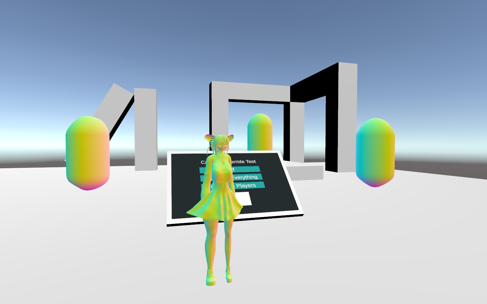

 

# Camera Override

Replace the player camera view in [VRChat](https://vrchat.com). Supports shader replacement.

This doesn't support photo camera or other cameras.

Get the newest .unitypackage from the [Releases section](https://github.com/Vavassor/OSPBillboard/releases) on GitHub and [import the package into Unity](https://docs.unity3d.com/Manual/AssetPackagesImport.html)!

